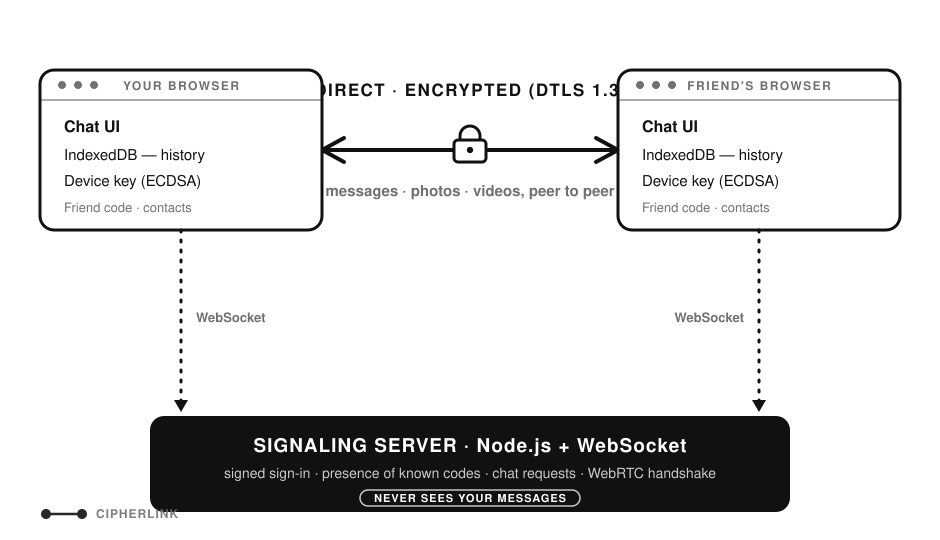

# CipherLink: Peer-to-Peer Chat in the Browser

### ▶ Try it live: **[cipherlink.duckdns.org](https://cipherlink.duckdns.org)**

A web messenger where chats, photos and videos go **directly between two browsers** over WebRTC.
The server only introduces users to each other. It never sees, relays or stores messages or files.
Chat history and contacts are saved only on each user's own device.

Built by **Aniket Deotale**.

## How to use it

1. Open [cipherlink.duckdns.org](https://cipherlink.duckdns.org) and join with a random display name.
2. Share your **friend code** (shown in the sidebar, like `K7QM-4XPD`) with a friend.
3. One of you enters the other's code under **Add someone by code**. The other accepts the request
   (if they're offline, it waits under **Requests** until they're back).
4. You're connected directly. Chat, send photos and videos, and compare the **safety number**.
5. Next time, just open the app: it signs you in and reconnects to your contact by itself.

Messages need both people online at the same time: there is no server to hold them for later.

## Features

- **Friend codes:** every device gets a random code (like `K7QM-4XPD`). You add people by code, so strangers can't find you
- **Chat requests:** the other person accepts or declines; accepting saves you in each other's contacts.
  A request to someone offline waits on the server (up to 7 days) and appears under **Requests** when they're back
- **Contacts with live status:** the server only reports the online status of codes you already know
- **Trusted contacts reconnect by themselves:** no new request after closing the tab. Reopening the app
  signs you in and reconnects to the chat you had open
- **Device keys:** each browser has its own signing key (ECDSA, non-extractable). It proves to the server
  that a friend code is yours, and to your contacts that it's still the same device
- Direct peer-to-peer text chat (WebRTC DataChannel, encrypted with DTLS)
- **Stays connected:** if the direct link drops (phone app in the background, network change), the chat
  reconnects automatically; only End chat closes it
- **Replies** (hover the reply button, or swipe a message right on touch screens) and a **typing indicator**
- **Delete messages** for yourself, or for everyone while connected (long-press on touch screens)
- **Cancel** a photo or video while it's sending or receiving, from either side
- **Photos and videos** up to 100 MB, sent in 16 KB chunks with backpressure and a progress bar
- **Live connection panel:** network route, latency and encryption, read from WebRTC's own stats
- **Safety number** to verify that nobody is intercepting the chat (MITM detection)
- Chat history stored locally in IndexedDB, with export to JSON
- Notification sounds synthesized with the Web Audio API (no audio files), with an on/off toggle
- **Notifications** (bell button): chat requests arrive as Web Push, even when the phone has put the
  browser to sleep; new messages show while the app is open in the background
- Responsive design for desktop and mobile

## How it works

<p align="center">
  <picture>
    <source media="(prefers-color-scheme: dark)" srcset="assets/architecture-dark.svg">
    
  </picture>
</p>

1. Each browser creates a random friend code and a device key, and joins the signaling server by
   signing a one-time nonce.
2. You enter a friend's code; the server forwards your chat request (or keeps it until they're online).
3. They accept. The browsers exchange an **offer/answer** (SDP) and **ICE candidates** through the server.
4. A direct **WebRTC DataChannel** opens. Messages and files go browser to browser.
   Even if the server is shut down, the open chat keeps working.

### Presence without a public user list
Clients send the server the codes of their contacts ("watch" list). The server only tells each
client about those codes. There is no global list of who is online.

### Photos and videos
A file is sent as a JSON `file-start` (name, type, size), then 16 KB binary chunks, then `file-end`.
The sender pauses whenever more than 256 KB is queued in the channel (**backpressure**) and resumes
once it drains below 64 KB, so the send queue stays small even on phones. Only formats that render inside `` or
`<video>` are accepted (no SVG), and media is never opened as a page.

### Safety number (MITM detection)
Each WebRTC connection uses a DTLS certificate whose fingerprint is included in the SDP. Both users
hash the two fingerprints (SHA-256) into a 30-digit number. A server attempting a man-in-the-middle
attack would have to swap in its own certificates, so the two users would see different numbers.

### Device keys (automatic verification)
Each browser creates an ECDSA P-256 key pair once. The private key is **non-extractable**: the page
can sign with it, but no script can read it.
- **Signing in:** the server sends a one-time nonce; the browser signs it. The server remembers the
  first public key used with each code, so nobody else can sign in with your code.
- **Between contacts:** when a chat opens, each side signs the connection's two DTLS fingerprints.
  The first chat remembers the contact's public key (trust on first use). Later chats, including
  automatic reconnects without a popup, only open if the signature matches that key. Because the
  signature covers this connection's fingerprints, it can't be replayed, and a man-in-the-middle
  can't produce one. It's the safety number check, done automatically.

### What the server stores
Messages, photos and videos never reach it. It keeps only this, in `data/store.json`:

| Record | Why | Kept |
|---|---|---|
| Each code's public key | Only that device can sign in with the code | Until unused for 180 days |
| Requests to someone offline (who, when) | Delivered when they're back | Until answered, at most 7 days |
| Answers to those requests | Delivered to the requester | Until delivered, at most 7 days |
| Push subscription (browser push URL) | To wake a phone for a chat request | Until notifications are turned off |

Push payloads are encrypted for the receiving browser, so the push service (Google, Mozilla, Apple)
can't read them.

## Tech stack

| Part | Technology |
|---|---|
| Frontend | HTML, CSS, vanilla JavaScript (ES modules) |
| P2P connection | WebRTC (RTCPeerConnection, DataChannel), Google STUN server |
| Local storage | IndexedDB (messages, media blobs, contacts, device key) |
| Crypto | Web Crypto API: ECDSA P-256 device keys, SHA-256, secure random codes |
| Signaling server | Node.js, Express (static files), `ws` (WebSocket), `web-push` (VAPID Web Push) |
| Notifications | Service worker, Notification API, Push API |
| Hosting | AWS EC2 (Ubuntu), systemd, Caddy (automatic HTTPS via Let's Encrypt), DuckDNS |

## Run locally

```bash
npm install
npm start
```

Open http://localhost:3000 in two browser tabs. The second tab gets its own temporary code. Copy one
tab's code, add it from the other tab, and accept the request.

## Deployment

The live site runs on a single AWS EC2 `t3.micro` instance:

```
Visitor ──HTTPS──► Caddy (ports 80/443, automatic Let's Encrypt certificate)
                     └──► Node.js app on localhost:3000 (systemd service, restarts on failure)
```

Only ports 80 and 443 are open to the internet; the app port is reachable only through Caddy.
The server's small `data/` folder (public keys, waiting requests, push keys) stays on the server:
it is never committed or overwritten by a deploy.
Photos and videos never pass through the server, so hosting costs stay the same no matter how much
media people send.

## Project structure

```
server.js          Signaling server: signed sign-in, watch-list presence, requests (live and waiting),
                   handshakes, Web Push
public/index.html  Page layout
public/style.css   Styling
public/app.js      App logic: identity, contacts, chat-request flow, file transfer, UI
public/peer.js     WebRTC connection, DataChannel, backpressure, stats and safety number
public/storage.js  IndexedDB: messages, media, contacts and the device key
public/device-key.js  Device signing key (ECDSA): create, sign, verify
public/sounds.js   Notification sounds (Web Audio API)
public/notify.js   Notifications and the Web Push subscription
public/sw.js       Service worker: shows pushed and page notifications, focuses the tab on click
```

## Design decisions and limitations

- **Messages need both users online.** Offline delivery would require a central message store; this
  app has none. Only chat *requests* wait for someone offline. File transfers also need both people
  online until they finish.
- **One chat at a time.** New requests are auto-declined as "busy" while you're in a chat.
- **Encrypted in transit, not at rest.** Messages and media saved in IndexedDB are not encrypted.
- **A code belongs to one browser.** It's tied to that browser's device key, so it can't move to another
  device. Clearing site data creates a new code, and contacts need to add you again.
- **Trust on first use.** The first chat with someone remembers their device key without proof that it's
  really them; compare the safety number once to be sure. Every later chat is checked automatically.
- **Strict networks** (some mobile and corporate networks) need a TURN relay. The server supports one
  through the `TURN_URL`, `TURN_USERNAME` and `TURN_CREDENTIAL` environment variables.
- **Message notifications need the app open.** Messages never pass through the server, so it can't
  push them: they're shown by the page while it's open in the background. Chat requests are pushed,
  so they arrive even when the phone has put the browser to sleep. iPhones only allow web
  notifications for sites added to the home screen.
- **Clearing browser data deletes your code, contacts and history.** Use Export to keep a copy of chats.

## Future improvements

- Encrypt local storage with a password-derived key
- Several chats at once (one peer connection per contact)
- TURN server for strict networks

## License

[MIT](LICENSE) © Aniket Deotale
